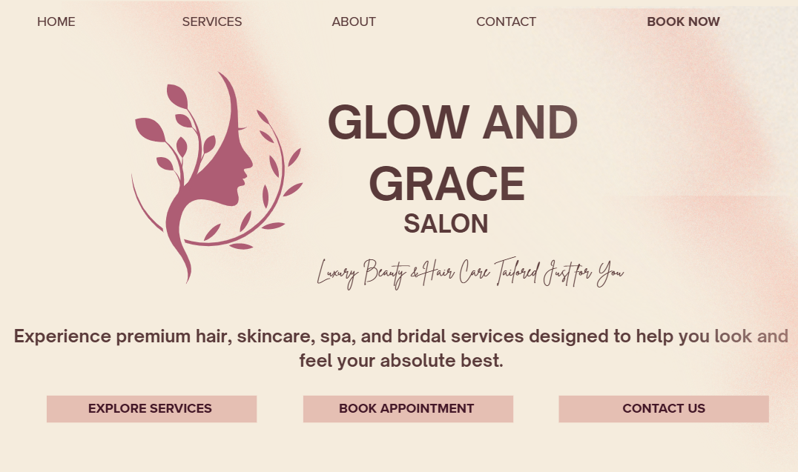
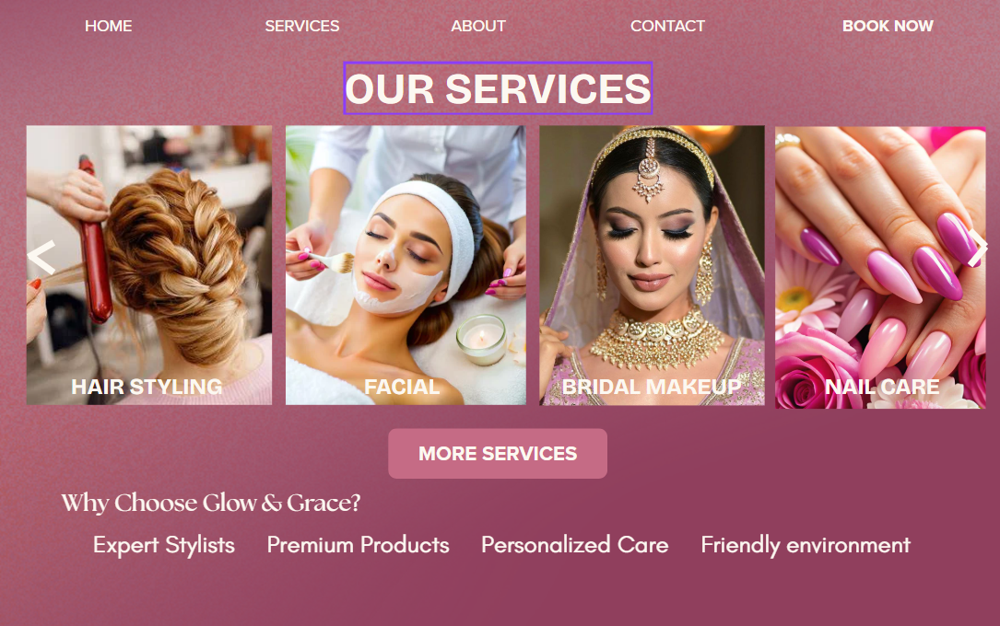
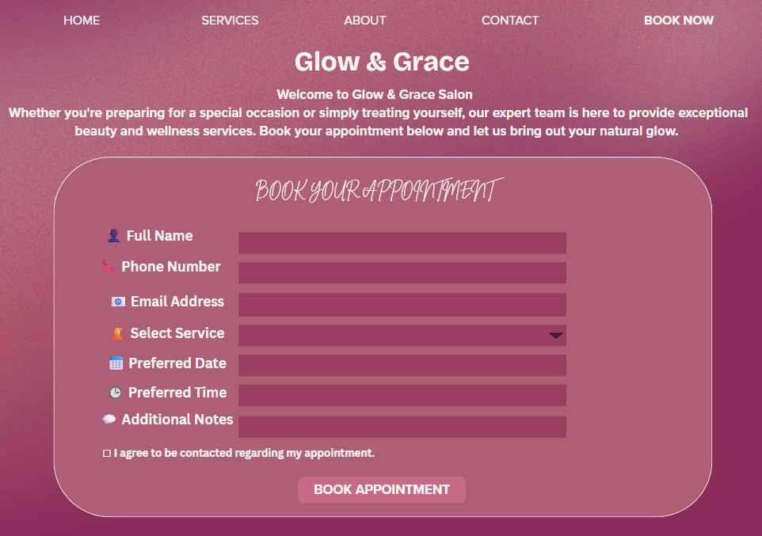
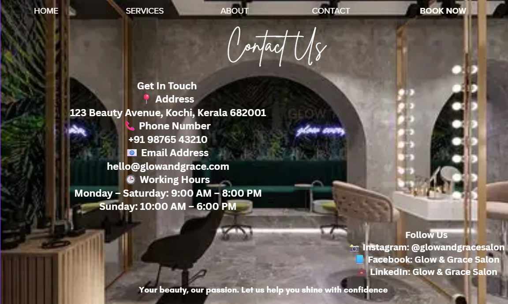
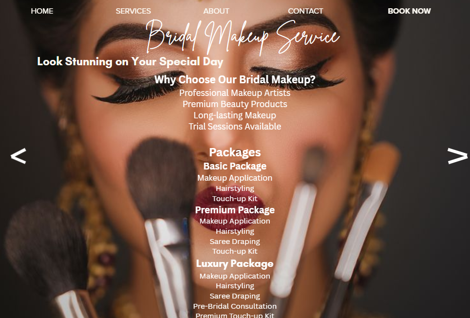

# Glow & Grace Salon Website Redesign

## Project Overview

This project is a UI/UX redesign of a salon website created for the Future Interns UI/UX Design Internship Task 1.

The website focuses on improving:
- Lead generation
- Appointment bookings
- User engagement
- Conversion rates

through a clean, modern, and user-friendly design.

---

## Business Type

**Salon & Beauty Services**

---

## Target Audience

- Women aged 18–45
- Brides-to-be
- Working professionals
- Beauty and wellness enthusiasts

---

## Designed Pages

### 1. Homepage
- Clear value proposition
- Service highlights
- Strong CTA buttons
- Professional branding

### 2. Services Page
- Service showcase
- Beauty treatment categories
- Trust-building elements

### 3. Bridal Makeup Service Page
- Detailed service information
- Package details
- Booking CTA

### 4. Appointment Page
- Lead generation form
- Service selection
- Date and time booking

### 5. Contact Page
- Contact information
- Business hours
- Social media links

---

## UX Design Decisions

- Simple navigation for easy access
- Strong Call-to-Action buttons
- Luxury-inspired color palette
- User-friendly booking process
- Mobile-friendly layout structure

---

## Tools Used

- Canva
- GitHub

---

## Outcome

The redesign improves user experience, builds customer trust, and encourages visitors to book salon appointments efficiently.

---

## Screenshots

### Homepage

### Services Page

### Appointment Page

### Contact Page

### Bridal Makeup Service Page

